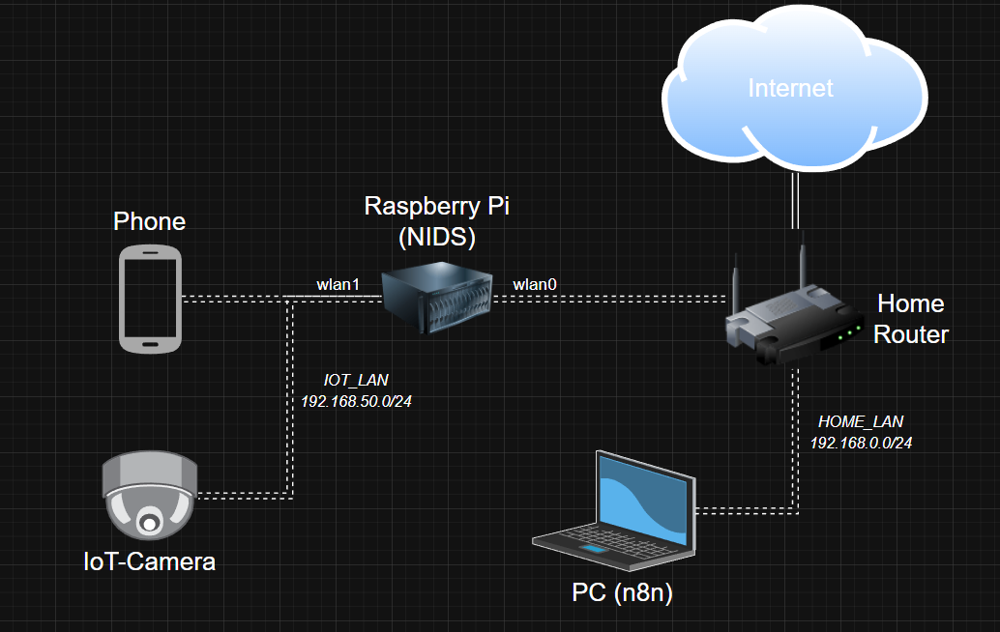
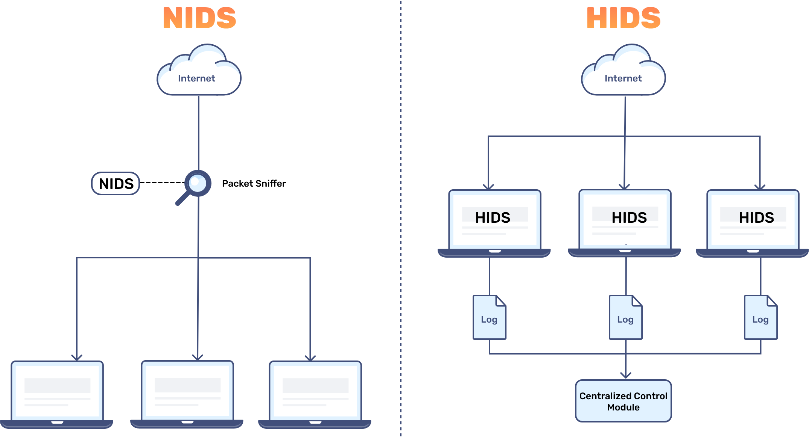
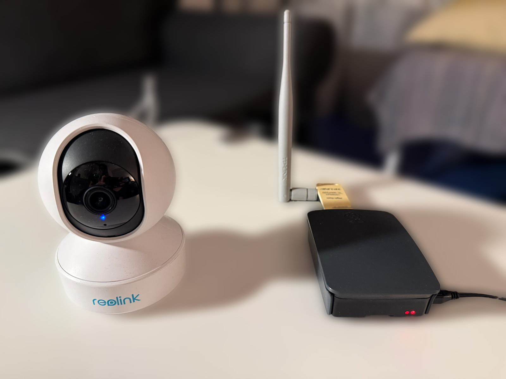
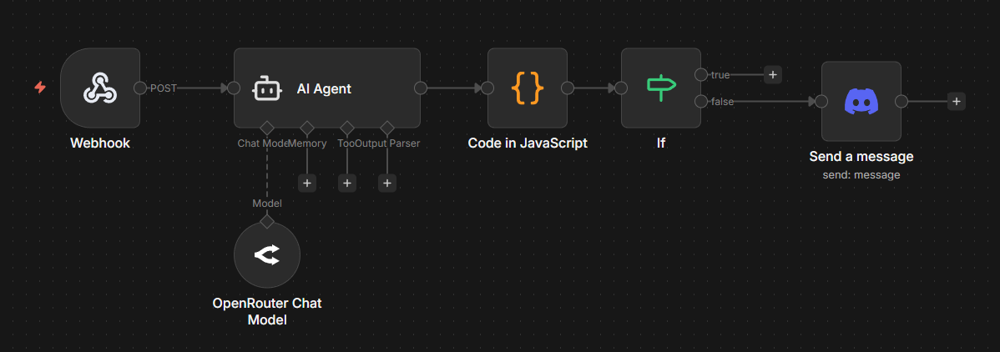
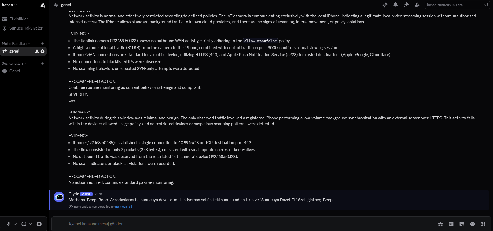

# Smart Home Network Threat Monitor

## Overview

This project documents the design and implementation of a local-first **Smart-Home Threat Monitoring system** (a gateway-based NIDS) that passively **observes IoT + home-network traffic metadata**, **detects anomalous or policy-violating behavior**, and **generates human-readable security assessments and alerts—without** relying on cloud inspection or payload analysis. 

A Raspberry Pi is used to create and control an isolated subnet for smart-home/IoT devices (**segmented network**), enabling predictable visibility into device behavior while keeping the environment privacy-preserving. Telemetry is summarized in short windows (e.g., 1 minute) and analyzed on n8n using an LLM constrained to connection metadata only (IPs, ports, protocols, packet/byte counts, SYN-only attempts, device roles, and policy constraints). Final assessments are delivered to the user via a Discord bot, which posts the LLM-generated report (and can be configured to alert only on high severity).



## Table of Contents

1. [Overview](#overview)
2. [Motivation](#motivation)
3. [Hardware Used](#hardware-used)
4. [Initial Setup](#initial-setup)
5. [Passive Telemetry Collection & Aggregation Pipeline](#passive-telemetry-collection--aggregation-pipeline)
6. [Automated Analysis & LLM-Driven Orchestration (n8n)](#automated-analysis--llm-driven-orchestration-n8n)
7. [Real-World Usability & Practical Considerations](#real-world-usability--practical-considerations)

## Motivation

This project was motivated by a central question: to what extent can a Large Language Model detect anomalous behavior in a network using only **high-level metadata**? In real-world environments—especially home networks and IoT ecosystems—payload inspection is often unavailable or undesirable due to encryption, privacy concerns, and resource constraints. This raises practical questions about the safety, accuracy, and efficiency of LLM-based analysis when visibility is limited.



The goal was to explore how **reliably** an LLM can reason about network behavior from constrained inputs such as connection patterns, packet and byte counts, device roles, and policy expectations. Beyond simple detection, the project investigates how to reduce false positives, avoid overconfident conclusions, and design prompts and workflows that encourage measured, **SOC-style reasoning** rather than speculative analysis.

Another key motivation was operational safety: understanding where LLM-based systems can assist human decision-making and where deterministic logic (e.g., explicit blacklists or policy violations) should take precedence. By combining rule-based checks with LLM-generated assessments and delivering results through clear, human-readable alerts, the project aims to evaluate whether such **hybrid systems** can be both effective and efficient for continuous, real-world smart-home monitoring.

## Hardware Used

| Component        | Model / Details              | Role in Setup                          |
|------------------|------------------------------|----------------------------------------|
| Single-board PC  | Raspberry Pi 3               | Network edge node: AP configuration, subnet isolation, telemetry collection   |
| IP Camera        | Reolink E330 (RTSP-capable model) | Representative IoT device for monitoring and policy enforcement                      |
| USB WiFi Adapter | TP-Link TL-WN722N            | Isolated camera WLAN                   |
| Client Device (Phone)    | Phone               | Test device for normal user traffic and policy comparison            |
| PC    | Laptop (running n8n)               | Workflow orchestration, LLM analysis, automation, and alerting comparison            |

---

## Initial Setup

The project began at the network edge, where a Raspberry Pi was configured as a central home-lab node responsible for creating and managing an **isolated subnet for IoT devices**. This placement allows the Pi to function as a monitoring and enforcement point between internal devices and the wider network, while preserving privacy by observing connection metadata only.

To achieve this, the Pi was configured with custom network interfaces and a dedicated Wi-Fi access point for IoT devices (iot-lan):

- **hostapd** was used to create and manage the wireless access point, defining SSID, channel, security settings, and the interface used for the isolated IoT network.

- **dnsmasq** was used to provide lightweight DHCP and DNS services for the subnet, ensuring predictable IP assignment and simplified device identification.



All relevant configuration files are included in the repository for transparency and reproducibility:

[*./configs/hostapd/*](configs/hostapd/hostapd.conf) — access-point configuration (SSID, interface binding, security)

[*./configs/dnsmasq/*](configs/dnsmasq/dnsmasq.conf) — DHCP/DNS configuration for the isolated subnet

This setup enabled controlled Wi-Fi connectivity for IoT devices and ensured that their traffic could be observed consistently at a single point, without interfering with the main home network. By segmenting devices at the network level, the system establishes a clean foundation for reliable telemetry collection, policy enforcement, and later automated analysis.

## Passive Telemetry Collection & Aggregation Pipeline

On top of the network foundation, I built a **passive telemetry pipeline** that aggregates short time-window summaries (typically 1-minute windows) of observed network activity. This stage forms the core of the entire project and required the most design iteration, experimentation, and debugging.

Rather than performing deep packet inspection, the pipeline operates strictly on **connection-level metadata**, reflecting realistic constraints in modern networks where traffic is encrypted and payload inspection is either impossible or undesirable. For each window, the system derives structured summaries based on:

- Source and destination IP addresses
- Transport protocol and destination ports
- Packet and byte counts per flow
- SYN-only connection attempts (connection initiation patterns)
- Observed WAN access versus internal (lateral) traffic
- Known device roles (e.g. IoT camera vs user device)
- Device-specific policy expectations (e.g. WAN allowed, blacklists)

Here are some [**example telemetry summaries**](tests/telemetry_window_with_scan.json).

The telemetry logic was implemented using [*signal_gateway.py*](nids/signal-gateway/signal_gateway.py) and supporting [*config.yml*](nids/signal-gateway/config.yml), which continuously observe traffic passing through the Raspberry Pi and distill raw observations into **compact**, **LLM-friendly** summaries. These summaries intentionally trade raw detail for signal clarity, allowing later stages to reason about behavior over a defined time window instead of reacting to individual packets or connections.

```python
summary = { # Example summary of 1-minute network telemetry
        "ts_start": ts_start,
        "ts_end": ts_end,
        "subnet": str(cam_subnet),
        "gateway_ip": gateway_ip,
        "devices": devices_out,
        "summary": {
            "top_flows": merged,
            "wan_activity": {
                "flows_to_public": flows_to_public,
                "new_public_dests": new_public,
            },
            "local_initiations": sorted(local_initiations, key=lambda r: r["syn_only"], reverse=True)[:top_limit],
            "scan_indicators": sorted(scan_indicators, key=lambda r: r["unique_dports_syn_only"], reverse=True),
            "policy_violations": policy_violations,
        },
    }
```

A major challenge during this phase was finding the right balance between **too little information** (which leads to ambiguous or inconclusive analysis) and **too much information** (which increases noise, cost, and complexity for downstream processing). Multiple iterations were required to refine which fields were essential, how flows should be grouped, and how anomalous patterns such as scanning or policy violations could be inferred purely from metadata.

This stage ultimately demonstrated that **telemetry design matters** as much as the analysis itself. Well-structured, context-aware telemetry significantly improves the quality and reliability of LLM-based reasoning. The pipeline is intentionally extensible, and future improvements could include richer flow aggregation, longer-horizon context, or adaptive windowing—all of which would allow the LLM to be fed higher-quality signals and make more accurate, confident assessments.

## Automated Analysis & LLM-Driven Orchestration (n8n)

To automate analysis and decision-making, I deployed [**n8n**](https://n8n.io/) as the central orchestration layer of the system. n8n is run locally in a Docker container on my laptop, which is connected to the same home network as the Raspberry Pi. This setup keeps all processing local while allowing flexible iteration on workflows, prompts, and automation logic without redeploying network components.



Incoming telemetry generated by the Raspberry Pi is ingested via **webhooks**, which serve as the interface between the passive monitoring layer and the analysis pipeline. Each webhook request represents a summarized telemetry window and triggers a new, stateless workflow execution in n8n. This design ensures that telemetry ingestion is **reliable**, **repeatable**, and **decoupled** from longer-running analysis steps.

Before analysis, the telemetry is enriched with **local configuration**, including per-device **policy information** and **blacklisted** destination IPs defined inside the workflow. This deterministic enrichment step ensures that explicit policy violations are surfaced consistently and do not rely solely on probabilistic LLM reasoning.

```json
"ts_start": 1769808540,
"ts_end": 1769808600,
"subnet": "192.168.X.0/24",
"gateway_ip": "192.168.X.1",
"devices": {
    "192.168.X.123": {
    "ip": "192.168.X.123",
    "name": "reolink_e330",
    "role": "iot_camera",
    "allow_wan": false,
    "blacklist": [
        "48.3.17.94"
    ]
    } //...
}    
```

The enriched telemetry is then passed to an LLM-based analysis agent. The model used for the assessment is *gemini-3-pro-preview*, a large language model designed for advanced reasoning over structured and semi-structured data. It was selected specifically for its strong **performance in analytical tasks**, **long-context understanding**, and **ability to follow strict reasoning constraints**.

The agent operates under a carefully constrained [**system prompt**](n8n/prompts/system-prompt.md) that enforces a **SOC-style mindset**: it reasons only from connection metadata, avoids speculation about payloads or malware, and weighs evidence conservatively to reduce false positives. A complementary [**user prompt**](n8n/prompts/user-prompt.md) supplies the structured telemetry context for the current time window.

The LLM produces a structured, text-based assessment rather than raw JSON, consisting of:

- A severity classification (low / medium / high)
- A concise summary of observed behavior
- Concrete evidence tied directly to telemetry fields
- A single, practical recommended action

This combination of webhook-driven ingestion, deterministic preprocessing, and constrained LLM reasoning allows the system to function as a **lightweight**, **local** security analysis pipeline, closely resembling how human analysts review summarized network data in real-world SOC environments.

```txt
SEVERITY: //Example for an LLM output
low

SUMMARY:
Network activity during this window was minimal and benign. The only observed traffic involved a registered iPhone performing a low-volume background synchronization with an external server over HTTPS. This activity falls within the device's allowed usage policy, and no restricted devices or suspicious scanning patterns were detected.

EVIDENCE:
- iPhone (192.168.X.X) established a single connection to 40.99.157.18 on TCP destination port 443.
- The flow consisted of only 2 packets (328 bytes), consistent with small update checks or keep-alives.
- No outbound traffic was observed from the restricted \"iot_camera\" device (192.168.X.X).
- No scan indicators or blacklist violations were recorded.

RECOMMENDED ACTION:
No action required; continue standard passive monitoring.
```

Finally, the system integrates with **Discord** for alerting. Based on the extracted severity level, medium and high severity events automatically trigger notifications that include the full LLM-generated assessment. This provides near real-time visibility into suspicious behavior while avoiding alert fatigue for normal or low-risk activity.



Once validated, the entire n8n workflow was published using a production webhook endpoint, ensuring that telemetry ingestion and analysis remain continuously available for ongoing home-network monitoring.

---

## Real-World Usability & Practical Considerations

Systems like the one developed in this project are well-suited for real-world deployment in **home networks** and **small environments** where traditional enterprise security tooling is either too heavy, too opaque, or too intrusive. By relying only on connection metadata and producing human-readable assessments, the system fits naturally into privacy-conscious settings and supports users who want **situational awareness rather than fully automated enforcement**. The local-first design, combined with lightweight alerting, makes it practical for continuous monitoring without requiring constant attention.

### Usability

Several open questions remain around **usability and effectiveness**. The quality of the system’s output is strongly dependent on **telemetry summary design**: clearer aggregation, richer context, and better representation of temporal patterns would allow the LLM to reason more accurately and detect more complex threats. Similarly, **prompt design** plays a critical role in balancing caution and usefulness; small changes in constraints or phrasing can significantly affect false positives and confidence levels. Finally, **LLM model choice** matters: different models vary in consistency, reasoning depth, cost, and robustness, and selecting the right model is essential for dependable operation.

### Practical Considerations

There are also important practical constraints to consider. **LLM pricing** directly impacts **scalability**, especially in environments with frequent telemetry windows. **Privacy** remains a central concern: even metadata can be sensitive, and decisions about logging, retention, and external transmission must be made carefully. Related to this are **storage and logging** considerations, as long-term retention of telemetry and assessments introduces both technical and ethical challenges.

Another limitation is the **stateless nature of LLMs**: without explicit memory or historical context, each analysis window is evaluated in isolation, which can reduce accuracy for slow-moving or long-term patterns. Additionally, in environments with heavy network traffic, summarization becomes more complex, and poorly designed aggregation can overwhelm both the LLM and the user with noise.

Together, these factors highlight that while LLM-assisted monitoring is promising, it requires thoughtful system design, careful operational boundaries, and ongoing refinement to be viable in real-world scenarios.